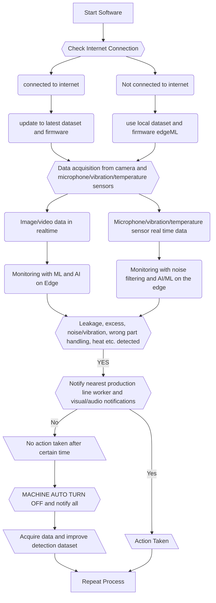

# Samvedan 2021 - TEAM MECHATRONICS

Documentation hosted on [sony.anshumanfauzdar.me](https://sony.anshumanfauzdar.me)

## Engineering guidelines to be followed:
**Guidelines to be followed for this project:**

- **KISS -** Keep it stupid simple.
- No extra features until and unless it is a bug.
- Revisit official documentation in case of no results found on google or forums.
- Create safe fallback features and try to re-create until and unless it is a bug.
- In case of creative block discuss with team ASAP.

**Promised Features:**

- Camera Monitoring - Images only
- Microphone - noise detection
- WiFi connectivity - ESP8266/32
---
For predictive maintenance:
- Temperature sensor - real time data
- Speakers - for notifications
- HMI - for displaying data
- Modular structure - 3D printed + aluminum extrusion structure
- Server - cloud implementation

## Development lifecycle
All the software, CAD, electronics development will be done with git and uploaded here to GitHub

1. Create a branch off of master:

Only in case of working on new feature not aligned with master branch.
Name the branch with your first name pre-pended [do not create unnecessary branches]:
spresense/cool-feature

2. Writing Code:

GitHub upload instructions:

- Standard PR should be made to merge features with log including changes and bug fixes.
- To make standard changes follow engineering guidelines.
- For making revision of CAD models mention version ex. Mount_v2.0.1

3. Submit for review:

- Assign the task to the appropriate reviewer.
- Once tested and approved from all team members PR will be merged.

## Software Architecture

## Road Map
- [ ]  [⚠️ VERY IMPORTANT ⚠️] **Burning Bootloader**
- [ ]  [⚠️ VERY IMPORTANT ⚠️] Setting up camera
- [ ]  Wi-Fi Connection - ESP8266
- [ ]  Try Examples - Wi-Fi functionality only
- [ ]  Try multicore functionality
- [ ]  Attach microphone and temperature sensors
- [ ]  Deploy to edge impulse
- [ ]  Initial image detection
- [ ]  Noise detection
- [ ]  Temperature variation detection
- [ ]  Mix all the detection in single application
- [ ]  Make webserver to show all data
